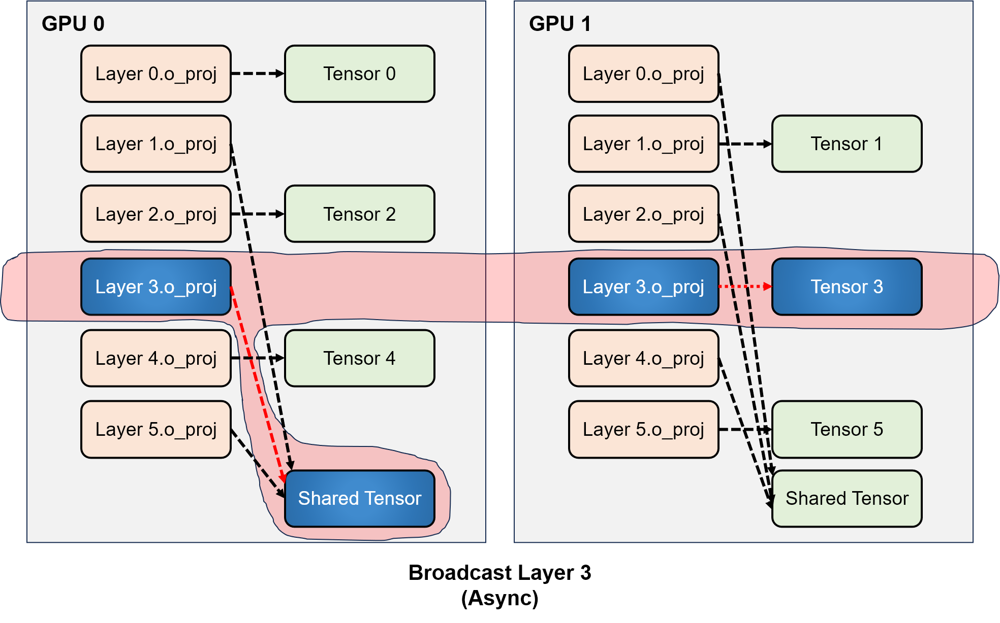
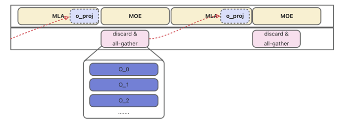
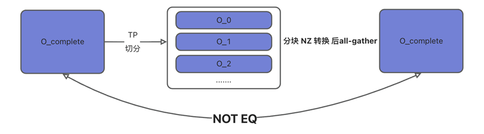
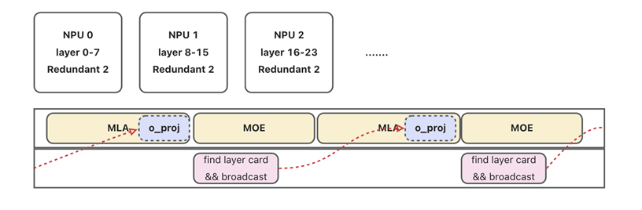

# Flashcomm2特性优化案例-Oshard显存优化

## 方案说明

FlashComm2 虽然能够降低通信量，但是由于取消了 O 矩阵的 TP 切，显存占用增加了很多，限制了支持的上下文长度。针对该问题，受训练场景中常用的 FSDP、ZeRO 优化手段启发，我们提出了 OShard 方案，**对 O 矩阵权重进行 shard 存储**

## 方案路线

### 方案1

NZ格式问题，导致All-gather后，无法和源tensor对齐

### 方案2

•使用broadcast代替All-gather，避开NZ问题

•设置冗余层，通信计算完全掩盖

