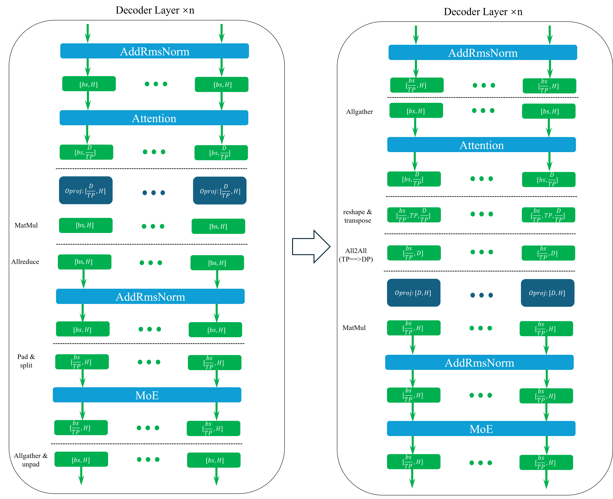
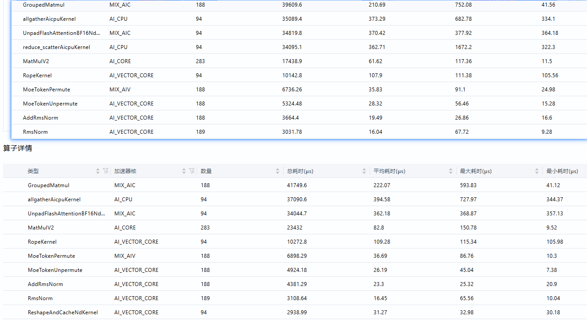
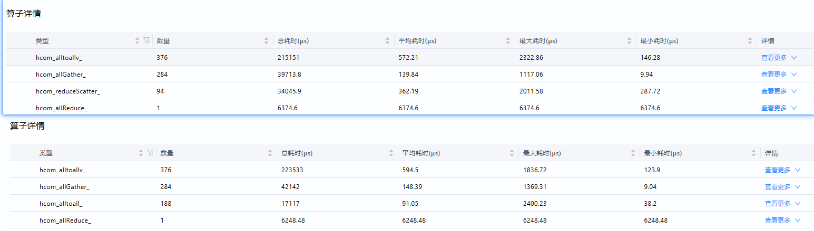
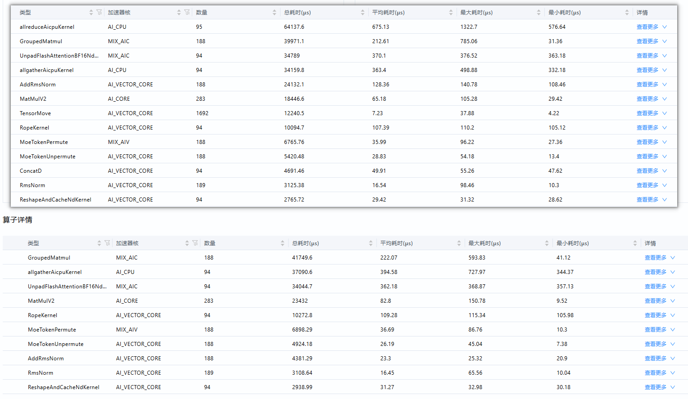
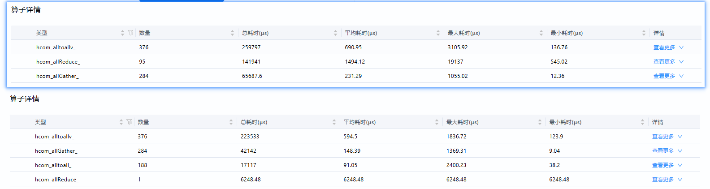

# FlashComm2特性设计文档

---

## 一、特性概述

### 1.1 背景概述

随着大语言模型（LLM）参数规模的持续增长，推理过程中通信开销显著上升，已成为性能瓶颈。FlashComm2 是一种旨在通过“以存换传”的策略优化通信效率的技术，其核心思想是通过数学等价变换，将通信操作前置并与计算操作协同优化，从而在不牺牲精度的前提下降低通信量，提升推理性能。

### 1.2 优化目标

FlashComm2 的优化目标在于：

- **降低通信开销**：通过将张量并行（TP）模式下的通信操作（如 ReduceScatter）前置为数据并行（DP）模式下的 All2All 操作，从而减少通信数据量。
- **提升推理性能**：在保证模型精度的前提下，优化 Prefill 阶段的时延，提升整体吞吐量。
- **适配大模型架构**：在典型 Transformer 架构如 Qwen3-MoE 中实现 FlashComm2 技术，以支持更大规模模型的高效推理。

### 1.3 优化场景

FlashComm2 主要应用于以下场景：

- **Prefill 阶段**：在生成第一个token之前，处理输入序列的阶段，通信开销尤为显著。在实际测试中，FlashComm2在Prefill阶段的性能提升最为明显。
- **分布式部署**：适用于多卡、多节点部署的场景，特别是在单卡内存有限的情况下，通过优化通信策略来提升整体性能。
- **高TP配置场景**：当张量并行度(TP)较高时，FlashComm2的优化效果更为显著。测试数据显示，在TP16DP1配置下，FlashComm2的优化效果最为显著，平均收益达到20.55%。
- **通信密集型模型**：对于注意力机制复杂、参数规模庞大的模型（如Qwen3-MoE、DeepSeek V3/R1等），FlashComm2能够显著降低通信开销。

---

## 二、方案设计

### 2.1 方案逻辑流程



**关键变量说明**：

```shell
n=num_hidden_layers，qwen3-235B-moe: 94
H=hidden_size，qwen3-235B-moe: 4096
D=num_attention_heads×head_dim，qwen3-235B-moe: 8192
bs=batch_size×seqlen
TP=TPsize
```

**流程说明**：

1. **通信前置**：将原本在Output投影计算后的Allreduce通信操作，调整为升维矩阵乘之前的All2All操作
2. **模式转换**：通过All2All通信将TP模式转换为DP模式
3. **本地计算**：在DP模式下进行完整的矩阵乘法计算
4. **结果聚合**：通过AllGather操作获取完整结果（将该步骤移动至残差连接模块之后，Attention模块之前，可以获取减小残差连接模块计算量的收益）

### 2.2 核心优化点

在 Qwen3-MoE 模型中，FlashComm2 的适配主要涉及对 MLP（多层感知机）和 Attention 模块中通信操作的重构。通过将部分通信操作前置，FlashComm2 能够减少在张量并行（TP）模式下的通信开销，从而提升整体推理效率。

#### 数学原理

FlashComm2的核心是基于数学等价变换的通信优化。考虑一个典型的矩阵乘法场景：

假设原始TP并行方案中：

- 输入X维度为[S, H/TP]
- 权重W维度为[H/TP, D]
- 输出Y维度为[S, D]

在TP模式下，需要进行ReduceScatter操作将结果分散到各卡，通信量为SD。

通过FlashComm2的"以存换传"策略：

- 将输入X通过All2All操作转换为[S/TP, H]
- 权重W保持为[H, D]（全载）
- 输出Y为[S/TP, D]

此时，通信量减少为(SD/TP)，为原始方案的1/TP倍。结合权重W矩阵的预取和int8量化技术将在显存占用较少增加的情况下大幅提升通信效率。

#### 与FlashComm1的对比

FlashComm2是在FlashComm1基础上的进一步优化：

- FlashComm1通过将AllReduce拆分为ReduceScatter和AllGather，并在中间插入计算操作，解决了通信次数多、通信数据量大的问题
- FlashComm2则更进一步，通过数学等价变换，将ReduceScatter前的矩阵乘(MatMul)从张量并行(TP)模式转换为数据并行(DP)模式，从根本上减少了通信量

### 2.3 适配逻辑流程

#### 2.3.1 MLP 模块适配

在 MLP 模块中，FlashComm2 通过以下步骤实现通信优化：

1. **AllGather操作**：在MLP输入阶段，通过AllGather操作将数据从DP模式转换为TP模式。这一步骤确保了输入数据的完整性，为后续计算提供基础。
2. **All2All操作**：在MLP的第二线性层（Down Projection）之前，通过All2All操作将数据从TP模式转换为DP模式。这一转换是FlashComm2的核心，它将原本需要在TP模式下进行的ReduceScatter操作，转换为DP模式下的本地计算。
   - **数学原理**：假设原始MLP中Up Projection的输出维度为[S, H×4/TP]，通过All2All操作将其转换为[S/TP, H×4]
   - **通信优化**：通信量从S×H×4减少到S×H×4/TP，降低了TP倍
3. **矩阵乘法优化**：通过DP模式下的矩阵乘法，避免在TP模式下的ReduceScatter操作，从而减少通信量。在DP模式下，每张卡可以独立完成完整的Down Projection计算，无需跨卡通信。
   - **计算量分析**：原始方案计算量为2×S×H×4×H/TP，FlashComm2方案计算量为2×S×H×4×H/TP，计算量相同
   - **内存优化**：由于权重全载，内存占用增加H×4×H×TP，但通信量显著降低

#### 2.3.2 Attention 模块适配

在 Attention 模块中，FlashComm2 的适配逻辑如下：

1.**All2All操作**：在Attention模块的输出投影（Output Projection）之前，通过All2All操作将数据从TP模式转换为DP模式。这是FlashComm2在Attention模块中的关键步骤。

- **输入维度转换**：将注意力输出的维度从[S, D/TP]（D为总头数×头维度）转换为[S/TP, D]
- **通信优化**：通信量从S×D减少到S×D/TP，降低了TP倍

2.**矩阵乘法优化**：通过DP模式下的矩阵乘法，避免在TP模式下的ReduceScatter操作，从而减少通信量。

- **计算分析**：假设原始O_proj的权重维度为[D/TP, H]，在FlashComm2中变为[D, H]
- **计算量**：原始方案计算量为2×S×D×H/TP，FlashComm2方案计算量为2×S×D×H/TP，计算量相同
- **内存分析**：权重内存占用增加(D×H)×(TP-1)，但通信量显著降低

3.**残差连接优化**：通过将Attention输出转换为DP模式，残差连接模块的计算量也相应减少。

- **原始方案**：残差连接计算量为S×H
- **FlashComm2方案**：残差连接计算量为S×H/TP
- **性能提升**：残差连接模块计算量减小，优化约105.06us（实测数据）

4.**通信量对比**：

- **原始方案**：在O_proj之后进行AllReduce操作，AllReduce通信的矩阵shape为[S, H]，通信量为2SH(TP-1)/TP
- **FlashComm2方案**：在Attention输出之后，O_proj之前，通信矩阵shape为[S, D/TP]，通信量为(SD/TP)(TP-1)/TP
- **优化比例**：通信量为原始方案的(SD/TP)/(2SH) = D/(2H×TP)，在Qwen3-235B-moe中H为4096，D为8192，优化比例约为1/TP

---

## 三、工程模块设计

### 3.1 代码变更概述

在 Qwen3-MoE 模型中，FlashComm2 的适配主要涉及对 `qwen3_moe.py` 文件的修改。通过对 MLP 和 Attention 模块的通信操作进行重构，实现了 FlashComm2 的优化。

### 3.2 主要变更点

3.2.1 MLP 模块变更

- **替换MLP实现**：将MLP的实现从CustomQwen3MoeMLP替换为Qwen3MoeMLP，以保持代码一致性。新的实现直接集成了FlashComm2的优化逻辑，无需额外的自定义类。
- **All2All通信优化**：在MLP的Down Projection之前添加All2All通信操作，实现TP到DP的模式转换。这一步骤是FlashComm2的核心，通过将通信前置，减少了后续计算的通信开销

3.2.2 Attention 模块变更

- **优化通信逻辑**：通过重构Attention模块的通信逻辑，实现了FlashComm2的优化。具体来说，在注意力计算完成后，立即将结果通过All2All操作转换为DP模式，然后进行Output Projection。
- **矩阵乘法优化**：在DP模式下进行Output Projection计算，避免了ReduceScatter操作。这一步骤显著减少了通信开销，特别是在高TP配置下。

### 3.3 代码结构

```
vllm_ascend/
├── models/
│   └── qwen3_moe.py                  # 主模型文件
│       ├── CustomQwen3MoeMLP         : 重构的MLP层
│       │   ├── __init__              : 启用FC2时替换down_proj为ReplicatedLinear
│       │   └── forward               : All2All通信+数据重组
│       │
│       ├── CustomQwen3MoeAttention   : 重构的Attention层
│       │   ├── __init__              : 启用FC2时替换o_proj为ReplicatedLinear
│       │   └── attn_output_all_to_all: All2All通信函数
│       │
│       └── CustomQwen3MoeForCausalLM : 模型入口
│           └── forward               : 初始化FC2元数据
│
└── ops/
    └── sequence_parallel.py          # 通信原语
        └── init_metadata_for_flashcomm2 : Padding元数据生成
```

**配置开关**：

通过环境变量控制启用：

```
os.environ["VLLM_ASCEND_ENABLE_FLASHCOMM"] = "2"  # 启用FC2优化
```

---

## 四、测试方案

### 4.1 测试策略

为了验证 FlashComm2 在 Qwen3-MoE 模型中的优化效果，我们采用了以下测试策略：

1. **测试场景**：在不同输入长度（256、512、1k、2k、4k、8k）下，测试 FlashComm2 的优化效果。
2. **测试指标**：以 TTFT（Time To First Token）为指标，评估 FlashComm2 的优化效果。
3. **对比策略**：与原始方案进行对比，分析 FlashComm2 在不同 TP/DP 配置下的优化收益。

### 4.2 测试结果分析

以下为 FlashComm2 在 Qwen3-MoE 模型中的测试结果：

1. origin 在各个输入输出下的 Mean-TTFT

| 策略\输出输出 | 256-1  | 512-1  | 1k-1   | 2k-1   | 4k-1    | 8k-1    |
| :------------ | :----- | :----- | :----- | :----- | :------ | :------ |
| TP2DP8        | 236.01 | 247.16 | 370.95 | 620.11 | 1417.07 | 3659.9  |
| TP4DP4        | 229.05 | 234.12 | 268.83 | 422.17 | 884.73  | 2145.05 |
| TP8DP2        | 236.35 | 239.52 | 254.22 | 387.14 | 755.94  | 1807.95 |
| TP16DP1       | 189.85 | 190.05 | 214.34 | 322.8  | 733.96  | 3023.2  |

2. flashcomm2 在各个输入输出下的 Mean-TTFT

| 策略\输出输出 | 256-1  | 512-1  | 1k-1   | 2k-1   | 4k-1    | 8k-1    |
| :------------ | :----- | :----- | :----- | :----- | :------ | :------ |
| TP2DP8        | 229.18 | 248    | 366.52 | 612.95 | 1398.47 | 3595.04 |
| TP4DP4        | 224.5  | 227.75 | 258.03 | 408.92 | 859.14  | 2037.97 |
| TP8DP2        | 224.59 | 221.09 | 244.38 | 347.07 | 681.29  | 1582.99 |
| TP16DP1       | 157.77 | 162.39 | 178.35 | 261.09 | 585.77  | 1942.58 |

3. flashcomm2 相对 origin 在各个输入输出下的收益(%)

| 策略\输出输出 | 256-1   | 512-1    | 1k-1   | 2k-1   | 4k-1     | 8k-1       | **平均收益** |
| :------------ | :------ | :------- | :----- | :----- | :------- | :--------- | ------------ |
| TP2DP8        | 2.89395 | -0.33986 | 1.1942 | 1.1546 | 1.312567 | 1.77217957 | 1.331282714  |
| TP4DP4        | 1.98647 | 2.72083  | 4.0174 | 3.1385 | 2.892408 | 4.99195823 | 3.29126895   |
| TP8DP2        | 4.97567 | 7.69456  | 3.8707 | 10.35  | 9.875122 | 12.442822  | 8.201515982  |
| TP16DP1       | 16.8976 | 14.5541  | 16.791 | 19.117 | 20.19047 | 35.7442445 | 20.54908558  |
| **平均收益**  | 6.68841 | 6.1574   | 6.4683 | 8.4401 | 8.567643 | 13.7378011 |              |

### 4.3 结果分析

- **优化效果显著**：在 TP16DP1 配置下，FlashComm2 的优化效果最为显著，平均收益达到 20.55%。
- **输入长度影响**：随着输入长度的增加，FlashComm2 的优化效果逐渐增强，尤其是在 8k 输入长度下，优化收益最高。
- **TP/DP 配置影响**：在 TP/DP 配置中，TP 越大，DP 越小，FlashComm2 的优化效果越显著。

### 4.4 方案对比分析

此处通过采集poofiling数据，对比flashcomm2方案与flashcomm1方案、原始方案各个算子的性能结果，从而分析flahcomm2所取得的优化效果

#### flashcomm1对比分析

- MatMul劣化61.62us --> 82.8us  劣化21.18us



- all2all相对reducescatter优化 362.19us-->91.05us  优化271.14us



#### 原始方案对比分析

- Matmul劣化65.18us --> 82.8us  劣化17.62us  （Oproj矩阵乘搬运量增大）

  - 具体而言TP16DP1情况下，假设TP并行的数目为TPsize，原始MatMul左右矩阵大小分别为[batch_size×seqlen, num_attention_heads×head_dim/TPsize]，[num_attention_heads×head_dim/TPsize，hidden_size]

    假设TP=TPsize，S= batch_size×seqlen，H=hidden_size，D=num_attention_heads×head_dim，qwen3-235B-moe中H为4096，D为64 × 128 = 8192；原始计算量为2SDH/TP

  - fc2的方案MatMul左右矩阵大小分别为[S/TP，D]，[D，H]；现有计算量为2SDH/TP，计算量相同但由于右矩阵增大TP倍，搬运耗时增加

- AddRmsNorm优化 128.36us --> 23.3us  优化105.06us （残差连接模块计算量减小）

  - 通过all2all将Attention模块输出由TP转为DP后，残差模块可以每张卡上只保留对应DP数据的residual矩阵
  - 具体而言，假设原始residual矩阵shape为[S，H]，则flashcomm2中变为原先的[S/TP，H]，计算量显著减小



- all2all相对allreduce优化 1494.12us-->91.05us  优化1407.07us  （通信量减小）
  - 原始方案在Oproj之后进行Allreduce操作，Allreduce通信的矩阵shape为[S，H]，通信量为2SH(TP-1)/TP
  - fc2的方案在Attention输出之后，Oproj之前，通信矩阵shape为[S，D/TP]，通信量为(SD/TP)(TP-1)/TP，为原始方案的(SD/TP)/(2SH) = 1/TP，通信量显著减小



- 整体优化

  整体优化约（1407.07us+105.06us-17.62us）×num_hidden_layers = 1494.51us×94=140.48ms，符合开头给出的实际测试结果（实际由于并发量、快慢卡等问题会导致计算结果无法与此处benchmark测试结果完全对应）：

#### 结论与展望

- 结论

  FlashComm2 通过“以存换传”的通信优化策略，在 Qwen3-MoE 模型中实现了显著的性能提升。通过对 MLP 和 Attention 模块的通信操作进行重构，FlashComm2 有效降低了通信开销，提升了推理性能。测试结果表明，在不同 TP/DP 配置下，FlashComm2 的优化效果显著，尤其是在高 TP 配置下，优化收益最高。

- 展望

  - 通过量化技术进一步优化通信效率
  - 叠加使用Oproj矩阵的权重预取减小Matmul时的性能劣化
  - 抽象出flashcomm2相关代码，实现flashcomm2特性的接口化，方便接入各类transformer模型，但可能需要社区相关代码的重构配合


## 五、附录

### 关联PR

| PR链接                                                       | 日期 | 修改内容 | 提交人 |
| ------------------------------------------------------------ | ---- | -------- | ------ |
| https://github.com/coder-fny/vllm-ascend/commit/9ce3c426aa90445335972965159d12f550b37ae7 |      |          |        |

### 参考文档

[FlashComm2：大模型推理中以存换传的通信优化技术](https://gitcode.com/ascend-tribe/ascend-inference-cluster/blob/main/FlashComm/FlashComm2大模型推理中以存换传的通信优化技术.pdf)